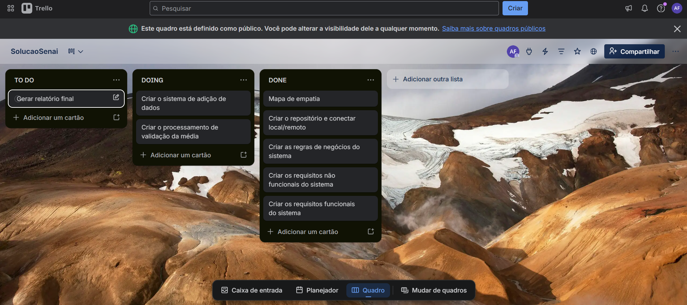

Levantamento de requisitos sistemaSENAI

RN
RN01 - A lista de notas dos alunos deve sempre estar completa  
RN02 - A estrutura da lista de tuplas deve ser nome seguido das notas do aluno  
RN03 - O sistema deve retornar tanto os alunos em situação de recuperação quanto aqueles com melhor desempenho  

RF
RF01 - calcular a média  
RF02 - gerar arquivo txt  
RF03 - Filtrar alunos em situação de recuperação e alunos com melhor desempenho  
RF04 - validar se a lista de notas esta vazia ou corrompida  

RNF
RNF01 - ter arquivo main.py para execução principal e processamento.py para processamento das informações  
RNF02 - rodar em no máximo 1 minuto  
RNF03 - se a lista estiver vazia, retornar erro na validação  

KANBAN

Mapa de empatia SENAI

1 - COM QUEM ESTAMOS SENDO EMPATICOS?

Quem é a pessoa que queremos conhecer?  
	A coordenação de uma escola

Em que situação ela esta?  
	Enfrentando problemas para acompanhar o desempenho acadêmico dos alunos de forma organizada rápida e confiável

2 - O QUE ELA PRECISA FAZER?

O que ela precisa fazer de diferente?  
	Criar uma forma de acompanhamento mais organizado rápido e confiável

Quais tarefas ela quer ou preciso fazer?  
	Acompanhar o desempenho acadêmico dos alunos de forma organizada

Qual decisão ela preciso tomar?  
	Mudar sua forma de acompanhamento

Como saberemos se ela foi bem sucedida?  
	Quando ela mantiver um acompanhamento aluno por aluno de forma rápida e precisa

3 - O QUE ELA VÊ?

O que ele vê no seu meio profissional?  
	Profissionais preocupados com a má organização do acompanhamento

O que ele vê no seu ambiente?  
	Alunos reclamando da falta de informação

O que ele vê os outros falando o fazendo?  
	Vê pessoas reclamando do método atual

4 - O QUE ELE FALA?

o que ja escutamos ele falando?  
	precisa de uma forma mais prática de percorrer esses dados, processar as notas corretamente e encontrar rapidamente os casos que exigem atenção.

o que imaginamos ele falando?  
	A dificuldade de continuar usando um método de acompanhamento ineficaz

5 - O QUE ELE FAZ?

O que ele faz hoje em dia?  
	Utiliza um método de acompanhamento acadêmico mal organizado e desconfiável

Qual comportamento dele já observamos?  
	A necessidade de mudar o método para um mais organizado e rápido
 
O que imaginamos ele fazendo?  
	Utilizando um método mais rápido e confiável

6 - O QUE ELE ESCUTA?

O que ele escuta outros dizerem?  
	Escuta alunos reclamando da falta de clareza, professores desconfiantes com o relatórios acadêmicos

7 - O QUE ELA PENSA E SENTE?

DORES
 Quais são seus medos, frustrações e ansiedades?  
	Medo de alunos insatisfeitos, medo da desconfiança dos professores, da coordenação, perder a credibilidade com os familiares dos alunos 

DESEJOS
 Quais são as suas vontades, necessidades e sonhos?  
	necessidade de um novo sistema capaz de realizar relatórios de forma rápida e confiável

